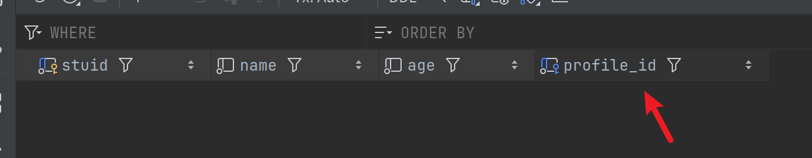
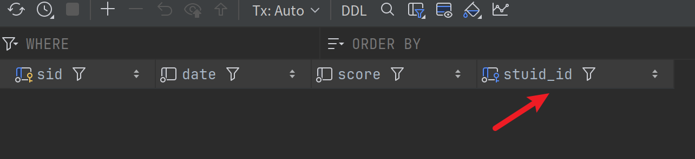
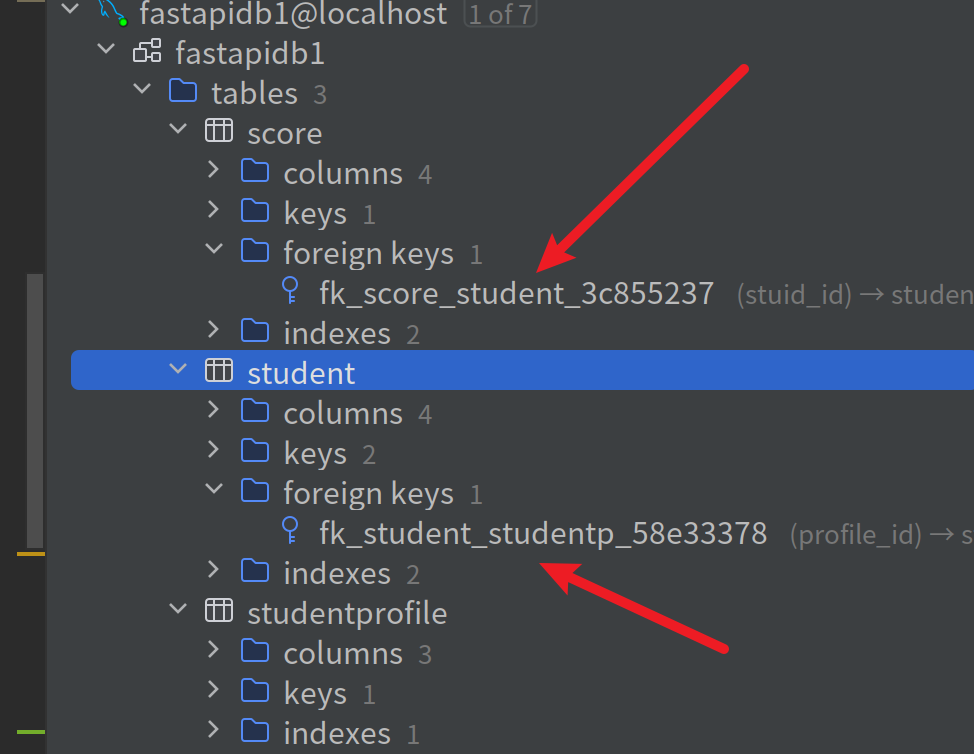
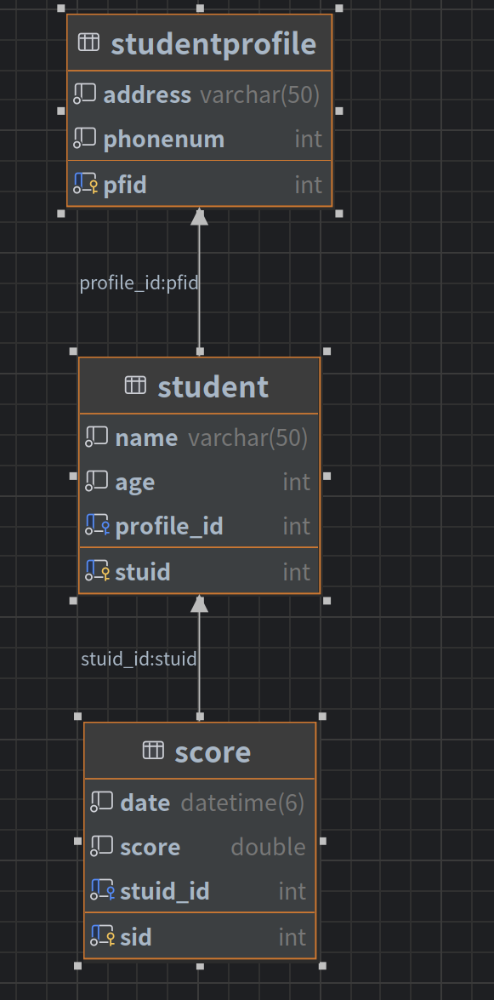

# 表关联关系
> 和之前学的flask和django中的理念是一样的
> 有1对1,1对多，多对多关系

⚠️需要注意的是本例中只使用到了models.py文件,main和config先忽略即可

## 例子
> 以学生成绩选课管理为例
> 一个学生只有一份学生信息档案-一对一
> 一个学生可以有多条成绩记录-一对多
> 一个学生可以选多门课程，一个课程有多个学生选-多对多
> 

- 一对一
```python
#tips:学生表
class Student(Model):
    stuid:int=fields.IntField(pk=True)
    name:str=fields.CharField(max_length=50)
    age:int=fields.IntField(validators=[agevalidator,])
    profile:str=fields.OneToOneField('models.StudentProfile',on_delete=fields.CASCADE,related_name='student')
    #tips:related_name表示反向查询引用标识，譬如知道档案想要查询学生表的时候就可以通过它来查到，和flask中的backref一样的，
    # 如StudentProfile对象.student.name,这样就可以通过档案表找到学生信息
    #

#tips:学生档案表
class StudentProfile(Model):
    pfid:int=fields.IntField(pk=True)
    address:str=fields.CharField(max_length=50) #档案保存地址
    phonenum:str=fields.IntField(validators=[phonevalidator])
```
> 创建好之后可以看到表结构
>
> 这是因为我们在student表中设置了
>profile:str=fields.OneToOneField('models.StudentProfile',on_delete=fields.CASCADE,related_name='student')
> 这样就会关联到profile的主键位，自动标记为profile_id  
> 其实一对一约束也可以写在StudentProfile中
```python
class StudentProfile(Model):
    pfid:int=fields.IntField(pk=True)
    address:str=fields.CharField(max_length=50) #档案保存地址
    phonenum:str=fields.IntField(validators=[phonevalidator])
	student:str=fileds.OneToOneField('models.Student',on_delete=fields.CASCADE,related_name='studentprofile')
```
⚠️ 但是，注意要写的话只一个表写就行，别俩表都写一对一

- 一对多
> 一个表中的字段在另一表中多次出现，那这个表的该字段可以作为另一张表的外键
> 譬如一个期别成绩表中有多条学生的信息
> 实现思路就是成绩表中学生id作为外键
```python
# #tips:成绩表
class Score(Model):
    sid:int=fields.IntField(pk=True)
    date:datetime=fields.DatetimeField(auto_now_add=True)
    score:float=fields.FloatField()
    stuid:int=fields.ForeignKeyField('models.Student',on_delete=fields.CASCADE,related_name='score')


```
- 这样之后可以看看表结构   
   
可以看到该表中有一列stuid_id标识的就是关联关系

- 当前的结构  


> 可以看出外键标识  
> 

-  多对多关系
> 一个学生可以选多门课程，一个课程也可以被多名学生选  

方式1 
```python
#tips:课程表
class Course(Model):
    cid:int=fields.IntField(pk=True)
    cname:str=fields.CharField(max_length=50)

# #tips：学生课程关系表
class StudentCourse(Model):
    id:int=fields.IntField(pk=True)
    #tips:如果不懈relarted_name的话默认也是链到外键表的主键
    course_id:int=fields.ForeignKeyField('models.Course',on_delete=fields.CASCADE) #tips:这里就和django很像！
    student_id:int=fields.ForeignKeyField('models.Student',on_delete=fields.CASCADE)
#
```
方式2 （和django中的一样,不推荐!）
```python
class Course(Model):
    cid:int=fields.IntField(pk=True)
    cname:str=fields.CharField(max_length=50)
    #tips:或者像django一样
    students = fields.ManyToManyField('models.Student',related_name='courses',through='StudentCourse')

```
这样会自动创建一张中间表(StudentCourse),但是其并不容易管理