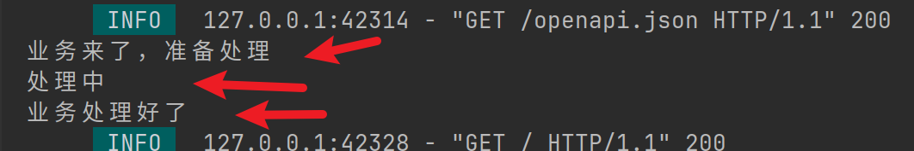
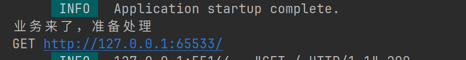
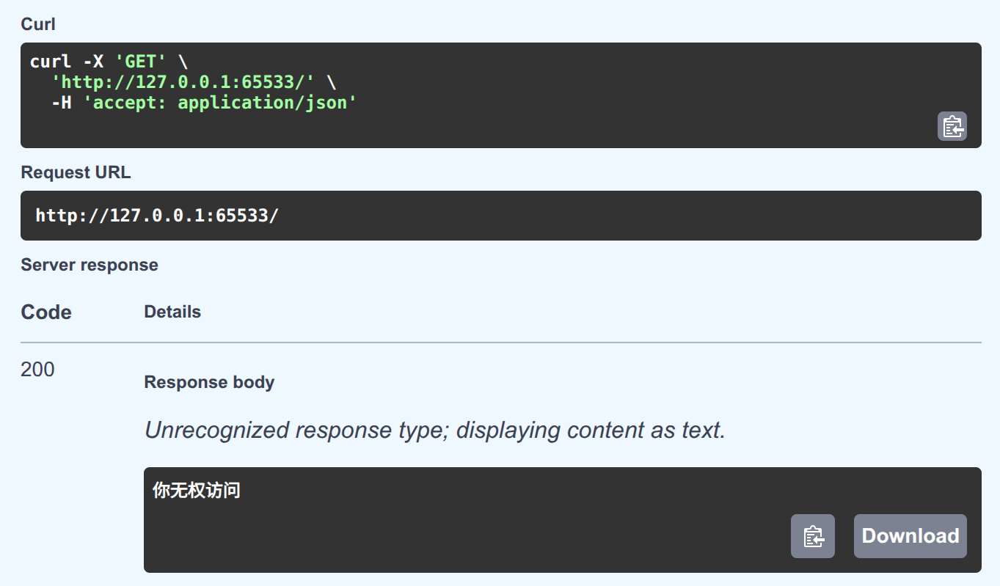
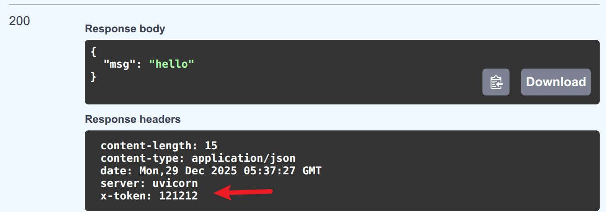
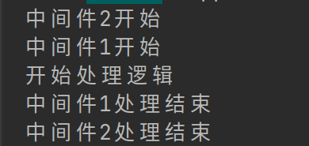

# 中间件
## middleware简介 
> 和django中的middlware,以及flask中的@before_request这种的对于请求和响应作出进一步操作的手段
> 负责拦截请求和响应，在请求到达路由处理程序之前进行处理
> 在响应返回给客户端之前进行处理


> 上图中以两个中间件为例子,中间件是处理请求和响应的，可能不止有两个中间件


## 代码定义
```python
@app.middleware('http')
async def middlware1(request, call_next):
    print('业务来了，准备处理')
    response = await call_next(request)
    print('业务处理好了')
    return response


@app.get('/')
async def root():
    print('处理中')
    return {
        'msg': 'hello'
    }
```


> 上面这个演示案例可以看到其顺序

## 还可以在request上做些操作   
```python

@app.middleware('http')
async def middlware1(request, call_next):
    print('业务来了，准备处理')
    print(request.method,request.url)
    if request.url.path == '/':
        return Response('你无权访问')
    response = await call_next(request)
    print('业务处理好了')
    return response


@app.get('/')
async def root():
    print('处理中')
    return {
        'msg': 'hello'
    }
```

  
   

> 这样可以进行请求的路由检测并拦截  
>

## 处理响应  
- 譬如我们可以设置响应头设置xtoken
```python
@app.middleware('http')
async def middlware1(request, call_next):
    print('业务来了，准备处理')
    response = await call_next(request)
    response.headers['X-Token']='121212'
    print('业务处理好了')
    return response


@app.get('/')
async def root():
    print('处理中')
    return {
        'msg': 'hello'
    }
```


# 多中间件
```python
@app.middleware("http")
async def middleware1(request,call_next):
    print('中间件1开始')
    response = await call_next(request)
    print('中间件1处理结束')
    return response

@app.middleware('http')
async def middleware2(request,call_next):
    print('中间件2开始')
    response = await call_next(request)
    print('中间件2处理结束')
    return response


@app.get('/')
async def index():
    print('开始处理逻辑')
    return {'msg':'hello world'}
```

> 要是这样写的话顺序就会是这样的
>   
> 


> 所以最好是按照321这样的写法那么按顺序就是123这样来的 ⚠️  
> 