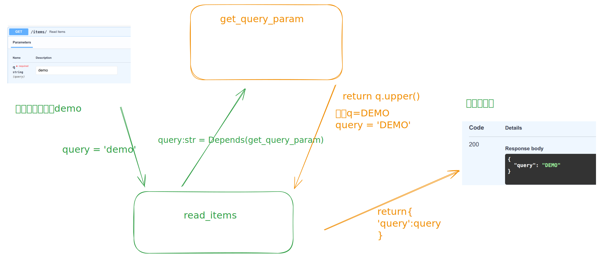
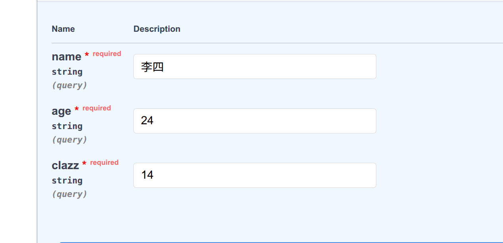
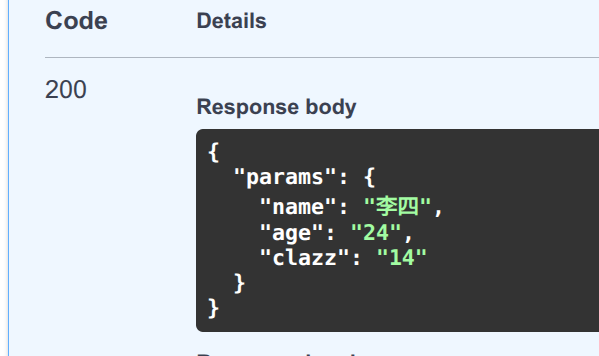

# 依赖注入  

## 依赖注入是什么
- 什么是依赖注入? 
> 依赖注入是一种设计模式，允许我们将“功能以来”以声明式方式注入到路由、中间件或其它组件中
> fastapi内建了强大的依赖注入系统，它不仅支持函数依赖，还支持类依赖，嵌套依赖等高级用法  

## 依赖注入的优势
- 优势  
> 提高代码的复用性
> 解耦业务逻辑与通用逻辑(如认证、数据库连接)
> 支持异步依赖
> 自动解析类型提示和参数  


## 依赖注入的作用域
- 依赖注入的作用域
1. 路径级别(PathOperation):最常用，注入到`@app.get()` / `@route.post`等装饰器下面的函数中  
2. 路由级别(APIRouter)-共享依赖: 将依赖注入到整个路由器下的所有路径操作
3. 全局级别(FastAPI)-全局依赖：将依赖注入到整个应用的所有路径操作

## Depends()基本语法
依赖可以是简单的函数或者类,FastAPI会自动解析并运行

- 示例代码
```python
from fastapi import FastAPI,Depends
app = FastAPI()

#简单依赖函数,定义一个函数实现将请求字段转为大写
def get_query_param(q:str='default'):
    return q.upper()

@app.get("/items/")
async def read_items(query:str = Depends(get_query_param)):
    return {'query': query}

```
> 上方定义的一个函数将传入的字符串转为大写,然后我们自己定义了一个read_items,设定了查询参数，指定为字符串类型
> 并添加了路径级别的依赖，这个函数的返回为将输入的原始请求参数返回，但因为指定了依赖，所以会将依赖函数执行并返回
> 所以返回的是大写的而不是原始请求参数返回


- 说明  
> get_query_param是一个依赖函数,接收查询参数q并返回其大写形式  
> 在read_items中,query通过Depends(get_query_param)注入
> FastAPI自动处理参数提取1和验证  

- 测试  
>访问/items/?q=demo->响应{'query':'DEMO'} 
>如果未提供q,则默认返回我们定义的q的默认值'default'

## ⚠️⚠️⚠️注意
值得注意的是，依赖注入后，按照的应当是依赖注入的参数，而不是我们自己写的查询参数
譬如我们上面的路由访问的其实是`/items/?q=xxx` 而不是我们自己写的查询参数中的`/items/?query=xxx`
理解这一点是非常重要的⚠️
- 例如下面的示例  
```python
def multiparams(name:str,age:str,clazz:str):
    return {
        'name':name,
        'age':age,
        'clazz':clazz
    }

@app.get('/demo')
async def get_params(params:dict=Depends(multiparams)):
    return {
        'params':params
    }
```



- 其url是`http://127.0.0.1:8000/demo?name=李四&age=24&clazz=14`所以并不是直接是我们自己写的那个params