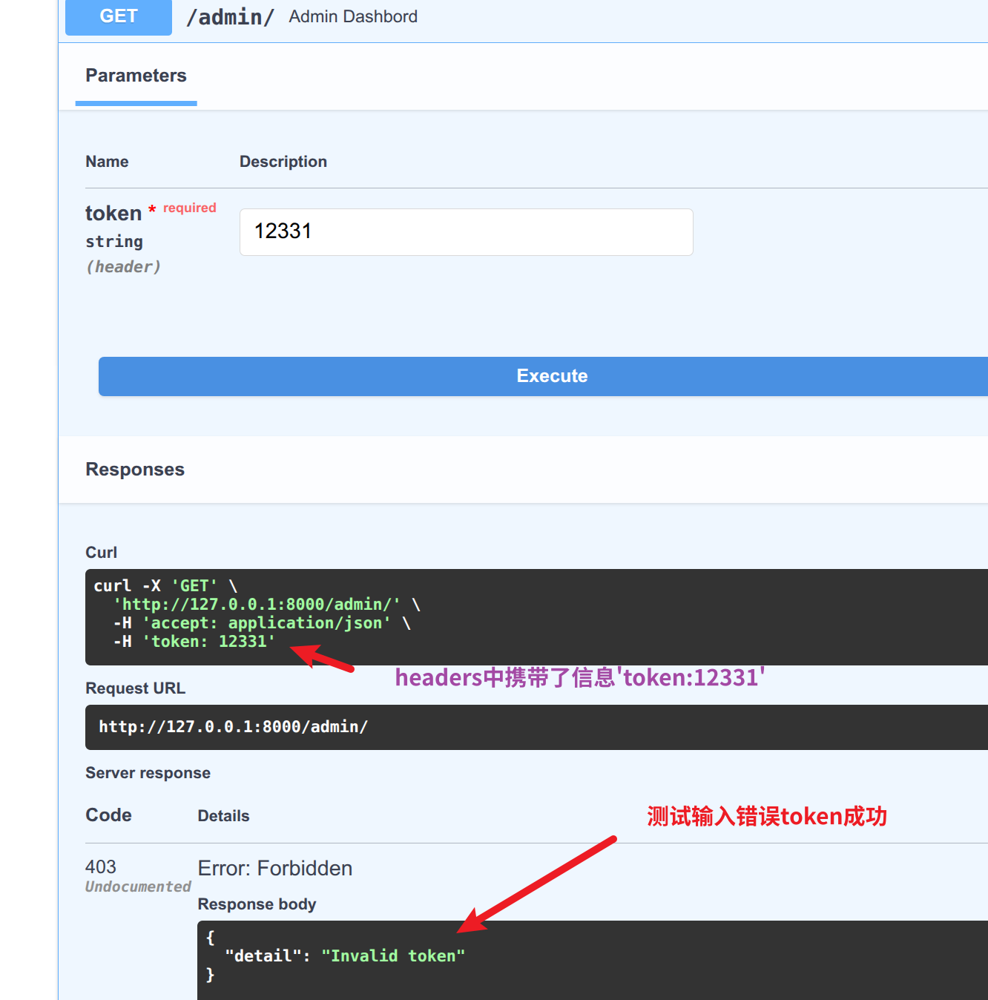

# 路径级依赖注入   
在fastapi中,路径级依赖注入是最常用的方式，它允许我们在单个路由中注入依赖项  
这些依赖会在请求到达路由处理函数之前执行,并可以用于参数验证、权限检查、数据库连接等  

- 特点
1. 作用范围:仅影响当前路径操作
2. 执行顺序：依赖项在路由处理函数之前执行
3. 参数传递：依赖项可以访问请求参数
4. 返回值：依赖项可以返回数据，供路由处理函数使用

> 之前的介绍中已经写了一种写法,就是写在视图函数当中  
> ⚠️不过值得一看的是这次获取的方式是使用我们自己指定的查询参数结合返回字典的键来进行索引的  
> 简单理解就是返回的是个字典，然后我们指定的查询参数又是依赖注入的“替身”😁
```python
#tips:定义一个获取分页的参数
def get_pagination_params(
        page:Annotated[int,Query(1,g1=1)],
        page_size:Annotated[int,Query(10,g1=1,le=100)]
):
    return {
        'page':page,
        'page_size':page_size,
    }

@app.get('/items/')
async def  get_items(pagination:int=Depends(get_pagination_params)):
    return {
        'items':[f'item{i}' for i in  range(1,4)],
        'current_page':pagination['page'],
        'page_size':pagination['page_size'],
    }

```


> 其实还有另外一种写法，就是写在路径当中
```python

#tips:定义一个函数检查token
def  check_user_permission(token:str=Header(...)): #tips:回顾一下，点点点是未写参数但是必填的意思
    if  token!='secret-token': #tips:这里没单独生成token,先用个假的'secret-token'替代
        raise HTTPException(
            status_code=status.HTTP_403_FORBIDDEN,
            detail='Invalid token'
        )
    return {
        'user':'admin'
    }

@app.get("/admin/",dependencies=[Depends(check_user_permission)])
async def  admin_dashbord():
    return {
        'message':'welcome to admin dashboard'
    }
```


## 总结
把查询参数或是别的功能集成到了依赖函数里边了，   
很多在请求时候需要填写的参数其实是依赖函数中的参数
理解了这两点之后就明白多了