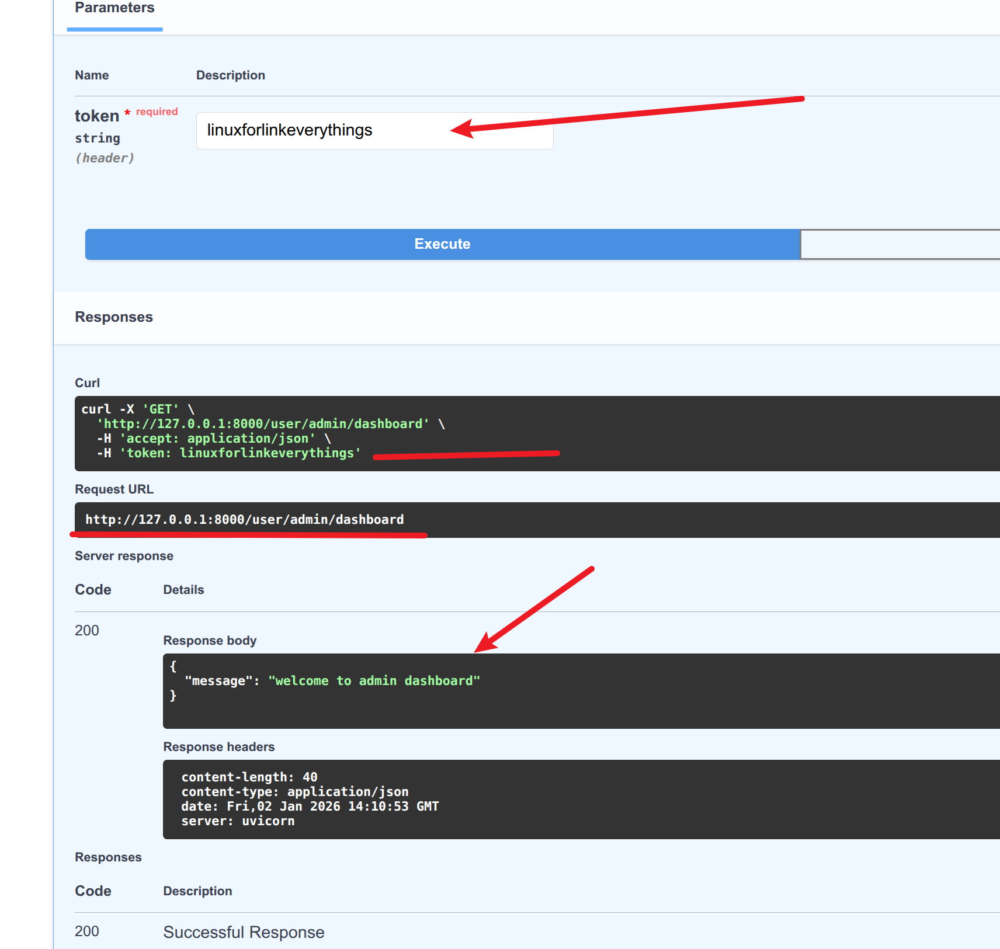
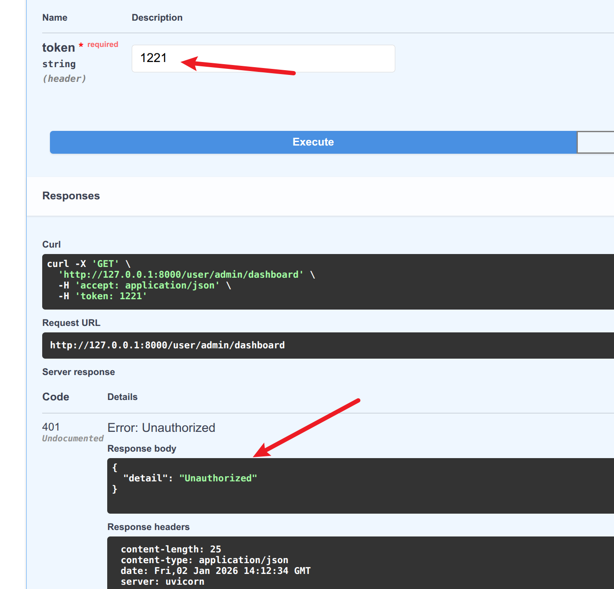

#  依赖注入-路由级

在fastapi中，`路由级依赖注入`允许我们为整个APIRouter下的所有路径操作(API端点)注入相同的依赖项，  
这种方式适用于**多个路由共享相同逻辑的情况**，例如:   
- 身份验证(所有路由都需要检查JWT token)
- 数据库会话管理(所有路由都需要访问数据库)
- 日志记录(所有路由都需要记录请求信息)

**特点**  
1. 作用范围:影响`APIRouter`下的所有路由
2. 执行顺序：依赖项在每个路由处理函数之前执行
3. 代码复用:避免在每个路由重复编写相同的逻辑
4. 可组合性：可以和路径级依赖一起使用(路径级依赖优先级更高哦⚠️)  


**示例代码**  
```python
tips:所谓路由级的依赖注入就是将其注册到整个路由当中
# 譬如，对用户数据做任何操作时都要检查token
from fastapi import FastAPI, Depends, APIRouter, Header, HTTPException

app = FastAPI()
async def check_auth(token:str=Header(...)):
    if token != 'linuxforlinkeverythings':
        raise HTTPException(status_code=401, detail='Unauthorized')
    else:
        return {
            'user':'admin'
        }


user_router = APIRouter(dependencies=[Depends(check_auth)]) #tips：为整个user路由注入依赖


#tips:进行了路由级别的注册之后，其下的路由都受到了保护

@user_router.get('/admin/dashboard')
async def admin_dashboard():
    return {
        'message':'welcome to admin dashboard'
    }

@user_router.get('/users')
async def admin_user():
    return {
        'users':'userinfo'
    }


app.include_router(user_router,prefix='/user',tags=['用户路由'])
```
- 输入正确就返回我们的路由中的信息

- 输入错误就甩出报错

