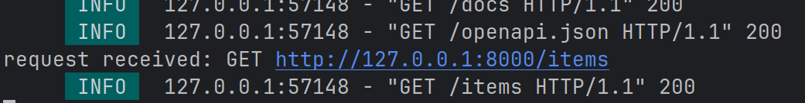

#  全局级的依赖注入   

在fastapi中,`全局级依赖注入`允许我们为整个应用的所有路由注入相同的依赖项。  
这种方式适用于所有API都需要执行的逻辑 
*特点*  
1. 作用范围:影响整个fastapi应用的所有路由  
2. 执行顺序：依赖项在所有路由处理函数之前运行  
3. 适用于：跨路由的通用逻辑(如日志、认证、限流)
4. 优先级:低于路径级和路由级依赖(可以被覆盖)

-  示例代码
```python
from fastapi  import FastAPI,Depends,Request

def logrequest(requset:Request):
    print(f'request received: {requset.method} {requset.url}')
    return {
        'logged':True
    }
app =  FastAPI(dependencies=[Depends(logrequest)])

@app.get('/items')
async def read_item():
    return {
        'items':'item successfuly geted'
    }

@app.get('/user')
async def read_user():
    return {
        'user':'user successfuly geted'
    }
```

可以看到访问路由后这个全局级别的注入确实被调用了
