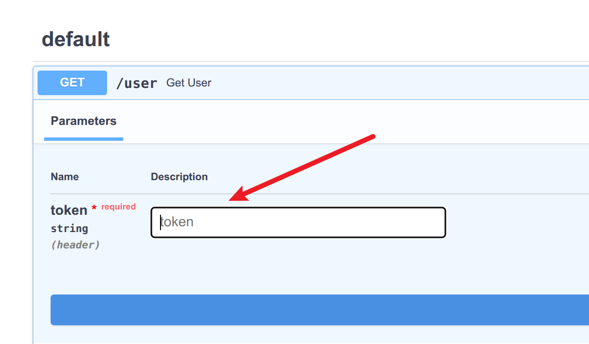
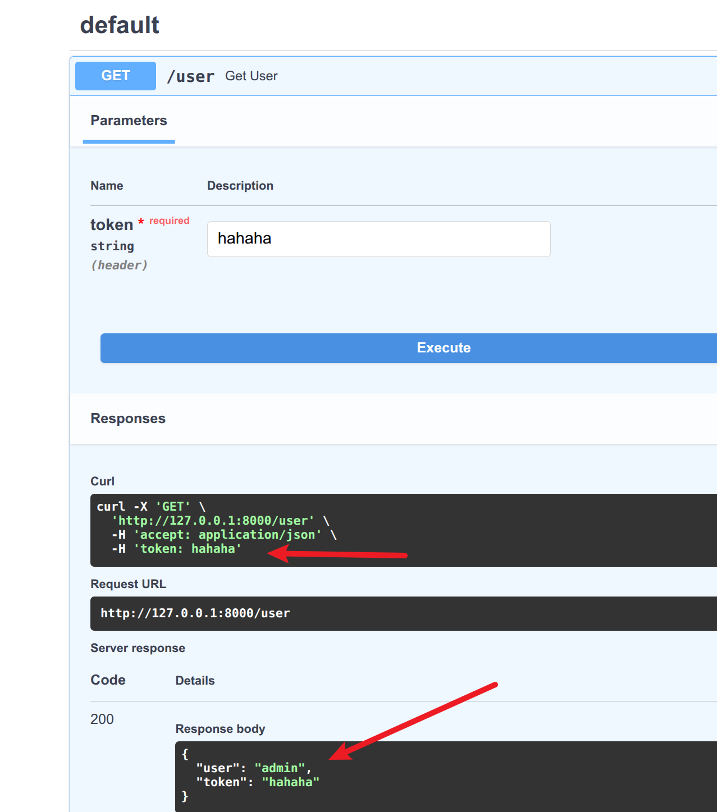

# 嵌套依赖
在fastapi中,*嵌套依赖注入*允许一个依赖项本身依赖于另一个依赖项，形成依赖链。   
这种方式适用于*复杂业务逻辑的拆分和复用*  
- 权限验证+用户信息获取(先验证token,再查询用户信息)
- 数据库连接+事务管理(先获取数据库连接，再开启事务)
- 参数校验+业务逻辑处理(先校验参数，再执行业务逻辑)

*特点*    
1. 依赖链:一个依赖可以调用另一个依赖
2. 执行顺序：从最外层依赖开始，逐层向内执行
3. 代码复用：避免重复逻辑，提高可维护性
4. 支持异步：嵌套依赖可以是同步或是异步函数

```python
from fastapi import FastAPI, Header, HTTPException,status,Depends
from typing import Annotated

def check_auth(token:Annotated[str,Header(...)]): #tips:这里用更优美的fastapi的写法
    if token!='hahaha':
        raise HTTPException(status_code=status.HTTP_403_FORBIDDEN,
                            detail='Invalid token')
    else:
        return token
def get_current_user(token:Annotated[str,Depends(check_auth)]): #tips:先进行依赖注入，看看token是否正确
    return {
        'user':'admin',
        'token':token
    }


app  =  FastAPI()

@app.get('/user')
async def get_user(user:Annotated[dict,Depends(get_current_user)]):
    return user
```
然后看swagger我们可以看到确实要求我们输入token,  
  

接下来我们输入正确的token看看返回  


可以看到链式依赖注入起作用了,从最外层依赖开始，逐层向内执行
