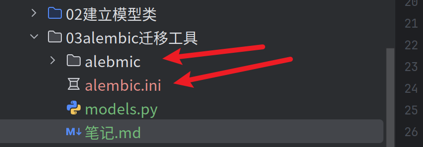
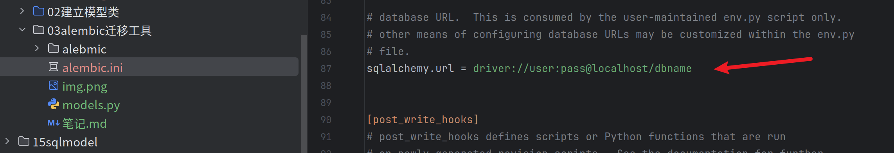
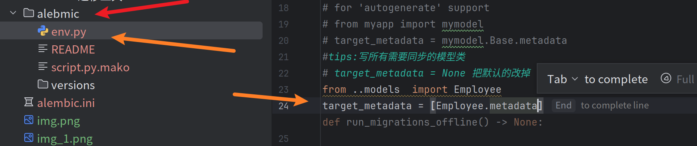
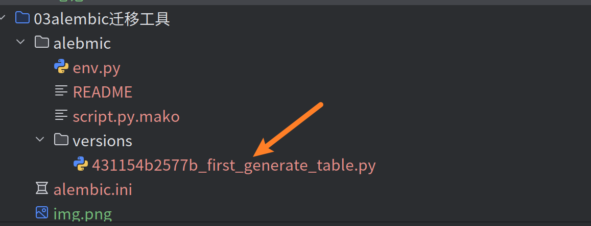
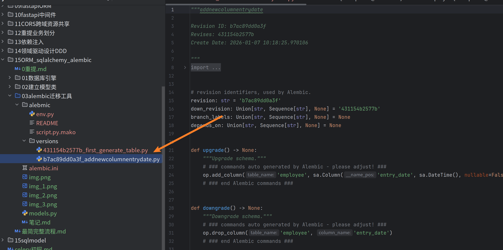

# alebmic数据库迁移工具
之前我们每次手动修改之后还需要再次运行生成，很不方便

```python
if __name__ == '__main__':
    Base.metadata.create_all(engine)#tips:利用这个来创建表
```
👆这种之后我们很少用

---
Alembic 使用SQLAlchemy作为底层引擎，为关系数据库提供变更管理脚本的创建、管理和调用
1. 安装
```bash
pip install alembic
```
2. 初始化alembic环境
```bash
alembic init alembic
```
```bash
(.venvs) nikofox@MOSS:~/fastapi_learn/15ORM_sqlalchemy_alembic/03alembic迁移工具$ alembic init alebmic
  Creating directory /home/nikofox/fastapi_learn/15ORM_sqlalchemy_alembic/03alembic迁移工具/alebmic ...  done
  Creating directory /home/nikofox/fastapi_learn/15ORM_sqlalchemy_alembic/03alembic迁移工具/alebmic/versions ...  done
  Generating /home/nikofox/fastapi_learn/15ORM_sqlalchemy_alembic/03alembic迁移工具/alembic.ini ...  done
  Generating /home/nikofox/fastapi_learn/15ORM_sqlalchemy_alembic/03alembic迁移工具/alebmic/script.py.mako ...  done
  Generating /home/nikofox/fastapi_learn/15ORM_sqlalchemy_alembic/03alembic迁移工具/alebmic/env.py ...  done
  Generating /home/nikofox/fastapi_learn/15ORM_sqlalchemy_alembic/03alembic迁移工具/alebmic/README ...  done
  Please edit configuration/connection/logging settings in /home/nikofox/fastapi_learn/15ORM_sqlalchemy_alembic/03alembic迁移工具/alembic.ini before proceeding.
  ```

然后就生成了两个文件


## 做修改定制
1. 需要修改alembic.ini中的数据库连接


2. 修改alebmic文件夹下的env.py文件，导入我们创建的模型类并修改target_metadata


3. 输入自动生成迁移脚本的命令
```bash
#自动生成迁移脚本
alembic revision --autogenerate -m "init commit" #注意修改了orm之后，修改-m后迁移脚本提示,信息自己随便填
#数据库迁移命令
alembic upgrade head

```
- `alebmic upgrade head` :将数据库升级到最新版本
- `alebmic downgrade   base` :将数据库降级到最初版本
- `alebmic upgrade <version>`  :将数据库升级到指定版本
- `alebmic downgrade <version>`:将数据库降级到指定版本
--- 
生成结果
```bash
(.venvs) nikofox@MOSS:~/fastapi_learn/15ORM_sqlalchemy_alembic/03alembic迁移工具$ alembic revision --autogenerate -m "first generate table"
INFO  [alembic.runtime.migration] Context impl MySQLImpl.
INFO  [alembic.runtime.migration] Will assume non-transactional DDL.
INFO  [alembic.autogenerate.compare] Detected added column 'employee.salary'
INFO  [alembic.autogenerate.compare] Detected added column 'employee.bonus'
INFO  [alembic.autogenerate.compare] Detected added column 'employee.is_leave'
INFO  [alembic.autogenerate.compare] Detected added column 'employee.gender'
  Generating /home/nikofox/fastapi_learn/15ORM_sqlalchemy_alembic/03alembic迁移工具/alebmic/versions/431154b2577b_first_generate_table.py ...  done
(.venvs) nikofox@MOSS:~/fastapi_learn/15ORM_sqlalchemy_alembic/03alembic迁移工具$ alembic upgrade   head
INFO  [alembic.runtime.migration] Context impl MySQLImpl.
INFO  [alembic.runtime.migration] Will assume non-transactional DDL.
INFO  [alembic.runtime.migration] Running upgrade  -> 431154b2577b, first generate table
```

然后可以看到文件中的versions生成了新的记录，数据库中的数据表也生成了

```bash
Database changed
mysql> show tables;
+----------------------+
| Tables_in_fastapidb4 |
+----------------------+
| alembic_version      |
| employee             |
+----------------------+
2 rows in set (0.00 sec)

mysql> desc  alembic;
ERROR 1146 (42S02): Table 'fastapidb4.alembic' doesn't exist
mysql> desc  alembic_version;
+-------------+-------------+------+-----+---------+-------+
| Field       | Type        | Null | Key | Default | Extra |
+-------------+-------------+------+-----+---------+-------+
| version_num | varchar(32) | NO   | PRI | NULL    |       |
+-------------+-------------+------+-----+---------+-------+
1 row in set (0.00 sec)

mysql> select * from alembic_version;
+--------------+
| version_num  |
+--------------+
| 431154b2577b |
+--------------+
1 row in set (0.00 sec)

mysql> desc employee;
+-------------+-----------------------+------+-----+---------+----------------+
| Field       | Type                  | Null | Key | Default | Extra          |
+-------------+-----------------------+------+-----+---------+----------------+
| id          | int                   | NO   | PRI | NULL    | auto_increment |
| name        | varchar(40)           | NO   | UNI | NULL    |                |
| create_time | datetime              | NO   |     | NULL    |                |
| update_time | datetime              | NO   |     | NULL    |                |
| salary      | decimal(10,2)         | NO   |     | NULL    |                |
| bonus       | int                   | NO   |     | NULL    |                |
| is_leave    | tinyint(1)            | NO   |     | NULL    |                |
| gender      | enum('MALE','FEMALE') | NO   |     | NULL    |                |
+-------------+-----------------------+------+-----+---------+----------------+
8 rows in set (0.00 sec)
```

## 版本更新和迁移
在数据进行修改之后需要重新生成并更新
```bash
(.venvs) nikofox@MOSS:~/fastapi_learn/15ORM_sqlalchemy_alembic/03alembic迁移工具$ alembic revision  --autogenerate -m "addnewcolumnentrydate"
INFO  [alembic.runtime.migration] Context impl MySQLImpl.
INFO  [alembic.runtime.migration] Will assume non-transactional DDL.
INFO  [alembic.autogenerate.compare] Detected added column 'employee.entry_date'
  Generating /home/nikofox/fastapi_learn/15ORM_sqlalchemy_alembic/03alembic迁移工具/alebmic/versions/b7ac89dd0a3f_addnewcolumnentrydate.py ...  done
(.venvs) nikofox@MOSS:~/fastapi_learn/15ORM_sqlalchemy_alembic/03alembic迁移工具$ alembic upgrade head
INFO  [alembic.runtime.migration] Context impl MySQLImpl.
INFO  [alembic.runtime.migration] Will assume non-transactional DDL.
INFO  [alembic.runtime.migration] Running upgrade 431154b2577b -> b7ac89dd0a3f, addnewcolumnentrydate
```

可以看到进行了更新
