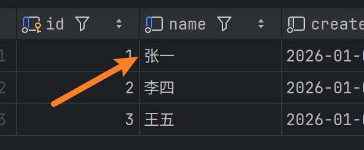
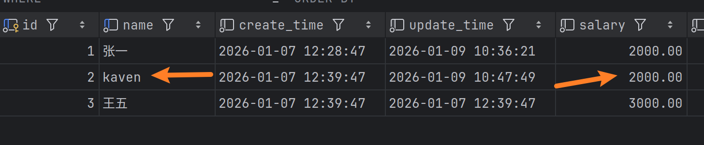
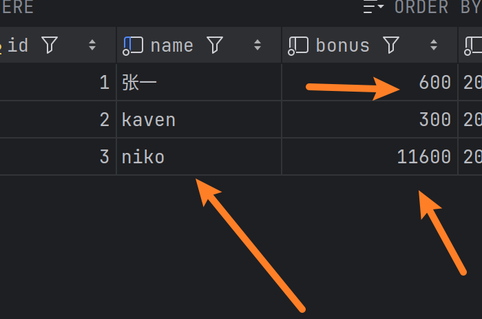
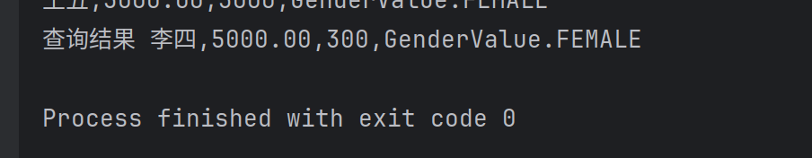
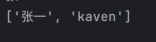

from sqlalchemy.orm import sessionmaker# Session操作
---
## 创建Session对象的两种方式

```python
from sqlalchemy.orm import sessionmaker

#第一种,需要自己提交事务
with Session(bind=engine) as session:
	session.begin()
	try:
		session.add(some_object)
		session.add(some_other_object)
	except:
		session.rollback()
		raise 
	else:
		session.commit()

#第二种,不需要自己体积iao事务
with sessionmaker(bind=engine).begin() as session:
	session.execute()

```
---
**接下来要说的就是利用session进行增删改查等操作，暂时不涉及到fastapi**
##   1 新增对象操作
对模型对象进行新增
```python
if __name__ == '__main__':
    with sessionmaker(engine).begin() as session:
        #tips:新增数据
        emp1=Employee(
            name='张三',
            salary=2000,
            bonus=300,
            gender=GenderValue.MALE,
            entry_date=date(2026, 1, 7),
        )
        session.add(emp1)
```
查看输出结果
```bash
2026-01-07 12:28:47,686 INFO sqlalchemy.engine.Engine INSERT INTO employee (name, salary, bonus, is_leave, gender, entry_date, create_time, update_time) VALUES (%(name)s, %(salary)s, %(bonus)s, %(is_leave)s, %(gender)s, %(entry_date)s, now(), now())
2026-01-07 12:28:47,686 INFO sqlalchemy.engine.Engine [generated in 0.00013s] {'name': '张三', 'salary': 2000, 'bonus': 300, 'is_leave': 0, 'gender': 'MALE', 'entry_date': datetime.date(2026, 1, 7)}
2026-01-07 12:28:47,687 INFO sqlalchemy.engine.Engine COMMIT

```

查看数据库发现也有数据了

值得注意的是，如果批量添加数据，那么有唯一约束的再添加会失败，进而导致本次事务回滚，导致合法的数据也插入不了

**批量添加**
利用session.add_all([xxx,xxx])可以进行批量添加数据
```python
if __name__ == '__main__':
    with sessionmaker(engine).begin() as session:
        # tips:新增数据
        # emp1 = Employee(
        #     name='张三',
        #     salary=2000,
        #     bonus=300,
        #     gender=GenderValue.MALE,
        #     entry_date=date(2026, 1, 7),
        # )
        emp2 = Employee(
            name='李四',
            salary=5000,
            bonus=300,
            gender=GenderValue.FEMALE,
            entry_date=date(2026, 1, 8),
        )
        emp3 = Employee(
            name='王五',
            salary=3000,
            bonus=3000,
            gender=GenderValue.FEMALE,
            entry_date=date(2026, 1, 9),
        )
        # session.add(emp1)
        #tips:批量添加
        session.add_all([emp2,emp3])
```

**还有一种类sql的方式**
```python
from sqlalchemy.dialects.mysql import insert
#tips:方式2,类sql方式，了解为主
        inert_stmt=insert(Employee).values(name='陈六',salary=5000,bonus=300,gender=GenderValue.FEMALE,entry_date=date(2026, 1, 9))
        inert_stmt=insert(Employee).values(name='陈六',salary=5000,bonus=300,gender=GenderValue.FEMALE,entry_date=date(2026, 1, 9))
        session.execute(inert_stmt)
        
        
        batchdata=[{'name':'刘七','salary':800,'bonus':1000,'gender':GenderValue.MALE,'enntry_data':datetime(2026, 1, 9)},
                   {'name':'刘八','salary':1800,'bonus':1000,'gender':GenderValue.MALE,'enntry_data':datetime(2026, 1, 9)}]
        #批量添加
        insertbatchdata = insert(Employee)
        session.execute(insertbatchdata,batchdata)
```

## 2 查询对象操作

1. 根据主键查询
```python
if __name__ == '__main__':
    with sessionmaker(bind=engine).begin() as engine:
		targetemp = session.get(Employee,2)
		        print(targetemp)

```
```bash
/home/nikofox/fastapi_learn/.venvs/bin/python /home/nikofox/fastapi_learn/15ORM_sqlalchemy_alembic/03alembic迁移工具/models.py 
<__main__.Employee object at 0x7f34eb5a3860>
```

可以看到打印的结果是一个Employee类型的对象,我们可以利用大象类型取值法
```python
if __name__ == '__main__':
    with sessionmaker(bind=engine).begin() as engine:
		targetemp = session.get(Employee,2)
		        print(targetemp)
		        print(targetemp.name,targetemp.salary)
```
```bash
<__main__.Employee object at 0x7cb3691dc620>
李四 5000.00
```

**或者,我们重写模型类中的__str__属性,让其进行直接返回指定的表字段**
```python
class Employee(Base, TimestampMixin):
    __tablename__ = 'employee'
    id: Mapped[int] = mapped_column(primary_key=True, autoincrement=True)
    name: Mapped[str] = mapped_column(String(40), unique=True, nullable=False)
    salary: Mapped[Decimal] = mapped_column(DECIMAL(10, 2), nullable=False, comment='员工薪资')
    bonus: Mapped[int] = mapped_column(default=0, comment='员工奖金')
    is_leave: Mapped[bool] = mapped_column(Boolean, default=False, comment="员工是否离职，默认不离职")
    gender: Mapped[GenderValue] = mapped_column(SAEnum(GenderValue), nullable=False)  # tips:利用枚举类来自动匹配
    entry_date: Mapped[date] = mapped_column(DateTime, insert_default=func.now(), nullable=False, comment='入职时间')
    def __str__(self):
        return f'{self.name},{self.salary},{self.bonus},{self.gender}'

```

重写`__str__`之后,对其进行查询打印后输出的就是我们指定的字段
```bash
李四,5000.00,300,GenderValue.FEMALE

```

2. 如果想获取完整数据,就需要session.scalars(语句)
scalars返回的是一个对象，所以需要遍历
```python
sqlstat = select(Employee)
allemply = session.scalars(sqlstat).all()
print(allemply)
```
```bash
[<__main__.Employee object at 0x73c78b8fd5b0>, <__main__.Employee object at 0x73c78b8fcc80>, <__main__.Employee object at 0x73c78b8fd580>]
```
虽然是返回了，但是我们仍然需要像处理单条数据那样处理它,由于我们重写了__str__所以直接遍历就能拿到
```python
sqlstat  = select(Employee)
allemply = session.scalars(sqlstat).all()
print(allemply)
for emp in allemply:
    print(emp)
```

```bash
[<__main__.Employee object at 0x7c64c6be1550>, <__main__.Employee object at 0x7c64c6be0c50>, <__main__.Employee object at 0x7c64c6be1520>]
张三,2000.00,300,GenderValue.MALE
李四,5000.00,300,GenderValue.FEMALE
王五,3000.00,3000,GenderValue.FEMALE
```

3.   获取指定的字段
```python
sqlstat2 = select(Employee.name, Employee.salary)
res = session.execute(sqlstat2)
for emp in res:
    print(emp)
```
```bash
('张三', Decimal('2000.00'))
('李四', Decimal('5000.00'))
('王五', Decimal('3000.00'))
```
或者取出数组中的值
```python
sqlstat2= select(Employee.name,Employee.salary)
res = session.execute(sqlstat2)
for emp in res:
  print(emp.name,emp.salary)
```

```bash
张三 2000.00
李四 5000.00
王五 3000.00
```
4.  原生sql写法
```python

sql = text('select id,name,salary from employee')
resalt = session.execute(sql).all()
for obj in resalt:
    print(obj)
    print(obj.name,obj.salary)

```


另外一种写法
```python
sql = text('select id,name,salary from employee')
#tips:建立映射关系
orm_map = sql.columns(Employee.id,Employee.name,Employee.salary)
statment = select(Employee).from_statement(sql)
res = session.execute(statment).scalars()
for obj in res:
    print(type(obj))
    print(obj)
```

可以看到返回的是模型类对象
它会懒加载，所以打印出的是全部数据,它已经自动加载完毕了
```bash
<class '__main__.Employee'>
张三,2000.00,300,GenderValue.MALE
<class '__main__.Employee'>
李四,5000.00,300,GenderValue.FEMALE
<class '__main__.Employee'>
王五,3000.00,3000,GenderValue.FEMALE
```

## 3  修改对象操作 
1. 方式一，通过id修改

```python
# 先查询后修改,譬如按照主键查询到id为1的修改其名字
employee1 = session.get(Employee, 1)
# 接着对其进行修改操作
employee1.name = '张一'
#tips:这样就可以了，不用像之前tortoiseORM那样需要save
```
因为我们用了with管理session,所以进行修改后它会自动帮我们提交事务


2. 优化，只用执行一条语句

```python
# tips:优化型
stmt = update(Employee).where(Employee.id == 2).values(name='kaven', salary=2000)
session.execute(stmt)
```


3. 批量修改
```python
session.execute(update(Employee), [
    {'id': 1, 'bonus': 600},
    {'id': 3, 'bonus': 11600, 'name': 'niko'}
])
```



## 删除操作    
有以下三种方式
建议使用第二种
```python
# 第一种方式
# emp = session.get(Employee,3)
# session.delete(emp)
#
# #第二种方式
# stmt = delete(Employee).where(Employee.id == 3)
# session.execute(stmt)
#

# 第三种方式，直接用sql
statment2 = text('delete from employee where id = 3')
session.execute(statment2)
```

## 查询条件  
过滤是数据提取的一个重要功能，以下对一些常用的过滤条件进行解释，    
并且这些过滤条件`都是`只能通过`where`方法实现的  
1. equals `==` ,或者 .is_函数
2. not equals `!=` ,或者 .isnot函数
3. like & ilike [不区分大小写]  
4. 在某个集合中存在,in_函数,或者notin_函数(不存在)
5. And 多条件组合  
6. 取反操作符  `~`  .where(~语句)
7. .is_(None) .isnot(None)  判空操作
8. 聚合函数 （不能用在where中,注意⚠️）
9. 分组查询 groupby
10. 排序操作
- like以及and_的用法
```python
#查询员工的名字中包含'四',并且薪资大于2000的员工

stmt = select(Employee).where(Employee.name.like('%四%'),Employee.salary>2000)
        #多条件组合
        # stmt2 = select(Employee).where(and_(Employee.name.like('%四%'),Employee.salary>2000))
        res_lst = session.execute(stmt).scalars()
        for obj in res_lst:
            print('查询结果',obj)

```
  
- or 和 in_的用法

```python
# tips:找到id是1,和id是5的
stmt5 = select(Employee).where(Employee.id.in_([1, 5]))
stmt5 = select(Employee).where(or_(Employee.id==1,Employee.id==5))
result = session.execute(stmt5).scalars()
for obj in result:
    print('---', obj)
```

- 取反与正则表达式
找到不姓张的
```python
 # stmt3 = select(Employee).where(Employee.name.regexp_match(r'^[^张]'))
stmt4 = select(Employee).where(~Employee.name.startswith('张'))
res_lst2 = session.execute(stmt4).scalars()
for obj in res_lst2:
    print(obj)
```

- 聚合函数的用法
func.avg()

```python

# tips:聚合函数，取出薪资平均值
avgsalary = session.execute(select(func.avg(Employee.salary))).scalar()
print(avgsalary)

# tips:sql写法
sql2 = text('select avg(salary) from employee')
res = session.execute(sql2).scalar()
print('平均工资', res)
```

func.count()

```python
 # tips:统计总人数
empsum = session.execute(select(func.count(Employee.id))).scalar()
print(empsum)
```

func.min()

```python
# tips:先用子查询查到最小工资，再进行判断看哪个工资等于这个工资
minsalary = session.execute(select(func.min(Employee.salary))).scalar()

# 但是!!!⚠️这样是有歧义的,因为可能很多个员工的工资都是这样的,所以最好是用scalars().all()找到所有的
minsaes = session.execute(select(Employee.name).where(Employee.salary == minsalary)).scalars().all()
print(minsaes)


stmt = select(Employee.name).order_by(Employee.salary).limit(1)
name = session.execute(stmt).scalar()  # 取第一个
print("最低工资的员工（之一）:", name)
```
scalars().all()返回的是一个列表



func.max()
```python
hsa = session.execute(select(func.max(Employee.salary))).scalar()
hieste = session.execute(select(Employee.name).where(Employee.salary == hsa)).scalars().all()
print(hieste)


```
--- 

- 分页查询的用法
```python
 # limit函数可以限制查询的时候只查询前几行数据,属于top-N操作
        # offset函数可以限制查找数据的时候过滤前面多少条，可指定开始查询时的偏移量

        #tips:查询前三条数据
        top3 = session.execute(select(Employee).offset(0).limit(3)).scalars().all()
        for emp in top3:
            print(emp)
```

```bash
张一,2000.00,600,GenderValue.MALE
kaven,2000.00,300,GenderValue.FEMALE
李四,5000.00,300,GenderValue.FEMALE
```


- 升降序排序

```python
# important:排序,默认升序
lesssalary = session.execute(select(Employee).order_by(Employee.salary).limit(3)).scalars()
for emp in lesssalary:
    print(emp)
# tips:降序

highrank = session.execute(select(Employee).order_by(Employee.salary.desc()).limit(3)).scalars()
for emp in highrank:
    print(emp)
```

- 分组查询
group_by(字段) 以该字段进行分组
```python
  #important:分组查询,查询有多少男性,并以id进行分组
        allmale = session.execute(select(Employee.gender,func.count(Employee.id)).group_by(Employee.gender)).all()
        for o in allmale:
            print(type(o))
            print(o)
            print(o.gender.value,o.count) #tips:前一个参数拿到的是性别枚举类的值,后面拿到的是其数量

```

```bash
<class 'sqlalchemy.engine.row.Row'>
(<GenderValue.MALE: '男'>, 1)
男 1
<class 'sqlalchemy.engine.row.Row'>
(<GenderValue.FEMALE: '女'>, 3)
女 3
```

- 分组后聚合,就是以前学mysql那时一样的理念，分组后的数据需要用.having(where语句)来进行分组后聚合