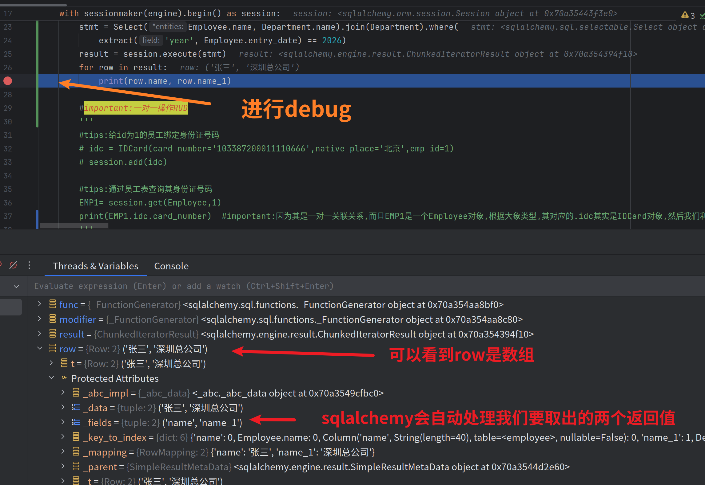

# 关联复杂查询  
>  本节代码在05多表关系中实现   


1. 进行多字段联表查询
```python
# 查询2026年入职的员工名以及该员工所在的部门名称
# extract就是我们想要抽取的内容,我们利用extract从Employee表的entry_date字段中抽取出年份
stmt = Select(Employee.name, Department.name).join(Department).where(
                  extract('year', Employee.entry_date) == 2026)
result = session.execute(stmt)
for row in result:
    print(row.name, row.name_1)

```
>  这里可能会有疑惑,我们select的字段可是两个字段,那么返回的是什么?
> 其实返回的是一个数组,但是我们如何取值呢?我们要的可是不同表的同名字段"name"啊！
> 其实sqlalchemy会帮我们自动处理好,如果我们要的是不同表的同名字段,它就会是name,name_1,name_2这样的形式以此类推

查看debug截图


⚠️或者,我们可以起别名,利用.label('字段别名'),推荐这样写,更方便
```python
#tips:或者我们还有别的解决方案,利用别名方式来更方便取值
stmt2 = Select(Employee.name.label('ename'),Department.name.label('dname')).join(Department).where(extract('year', Employee.entry_date) == 2026)
res   = session.execute(stmt2)
for row in res:
    print(row.ename, row.dname)

```

或者之前的笨方法,利用索引取值也是可以的

2.关于isouter外连接    
回顾外连接的概念，内连接查询的是二者共有的数据,而外连接分左右    
| 连接类型       | 保留哪些数据                     | Python SQLAlchemy 写法        |
|----------------|-------------------------------|------------------------------|
| INNER JOIN | 两边都有的记录（交集）           | `.join()`                    |
| LEFT JOIN  | 左边全保留，右边可空             | `.outerjoin()`               |
| RIGHT JOIN | 右边全保留，左边可空             | 不常用（可交换表 + left join）|

如果想要使用,我么只需在join中指定isouter=True即可，它默认是左外连接     
  
可以看到返回了没有分配部门的刘路  

如果想用右连接的话只需要交换顺序  
把
```python
stmt2 = Select(Employee.name.label('ename'),Department.name.label('dname')).join(Department,isouter=True).where(extract('year', Employee.entry_date) == 2026)

```  
换成
```python
stmt2 = Select(Employee.name.label('ename'),Department.name.label('dname')).join(Employee,isouter=True).where(extract('year', Employee.entry_date) == 2026)  

```
如果用全外连接(本例子不适用),join中可以填full=True这个参数即可


---   
**下面的例子中第二个需要修改department表的__str__ 方法**   
```python
        #tips:查询每个部门的名字以及部门下的员工个数

        #语句思路:选择外连接,
        stmt4 = Select(Department.name.label('dname'),func.count(Employee.id).label('ecount')).join(Employee,isouter=True).group_by(Department.id)
        res = session.execute(stmt4)
        for row in res:
            print(row.dname,row.ecount)

        #tips:查询每个部门的名字,city以及部门下的员工个数
        #可以去department.py中改写表的__str__返回
        stmt5 = Select(Department,func.count(Employee.id).label('ecount')).join(Employee,isouter=True).group_by(Department.id)
        res = session.execute(stmt5)
        for row in res:
            print(row[0],row[1])

```
上面操作的返回结果
```bash
深圳总公司 2
行政部 1
郑州二七区分公司 0
销售部 0
深圳总公司,深圳,1 2
行政部,深圳,2 1
郑州二七区分公司,郑州,3 0
销售部,郑州,4 0

```
查询每个部门的名字以及它里面的员工数量,并且按照员工数量的个数降低序排序

注意和之前的session操作中的降序操作是不一样的
```python
# tips:查询每个部门的名字以及它里面的员工数量,并且按照员工数量的个数降低序排序
stmt6 = Select(Department.name, func.count(Employee.id).label('ecount')).join(Employee, isouter=True).group_by(
    Department.id).order_by(desc('emp_count'))
res = session.execute(stmt6)
for row in res:
    print(row[0], row[1])
```
运行结果  
```bash
深圳总公司 2
行政部 1
郑州二七区分公司 0
销售部 0
```


---  
接下来的操作在06的多表关系之多对多的代码中实现    

注意这块儿用了子查询,使用了子查询中的结果作为父查询的条件
```python
        #important:先定义一个子句，之后将子句作为条件进行父查询
        sub_stmt = Select(User.username,func.count(Role.id).label('role_count')).join(User.roles).group_by(User.id).subquery()
        stmt = Select(sub_stmt.c.username,sub_stmt.c.role_count).where(sub_stmt.c.role_count > 1)
        res = session.execute(stmt)
        for row in res:
            print(row[0],row[1])
        #查询结果 zhangsan 2
```

